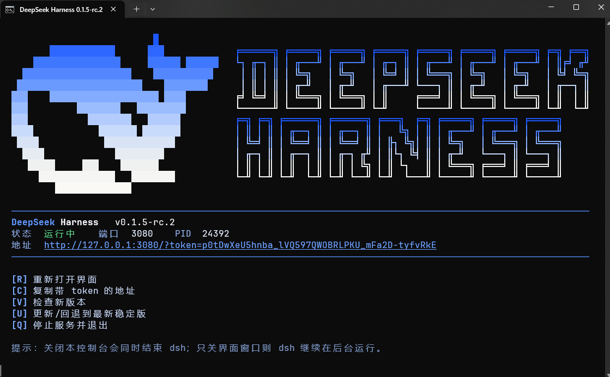
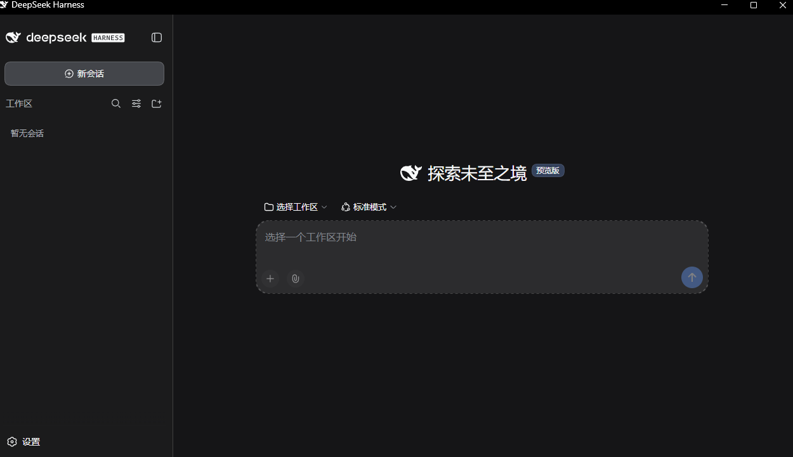

# DeepSeek Harness 简易桌面启动器

一个**单文件、双击即用**的 Windows 启动脚本（`DSH启动.bat`），把 `dsh web` 包装成一个带像素风界面的"桌面版"控制面板：自动启动服务、自动打开界面、自动居中窗口，关闭方式所见即所得。

> 依赖的 npm 包：[@deepseek-ai/dsh](https://www.npmjs.com/package/@deepseek-ai/dsh)

**只需要这一个文件**：不依赖任何配套脚本、配置或资源文件，把 `DSH启动.bat` 放到任意目录双击即可。Node.js 与 dsh 是 dsh 本身的运行环境，缺失时脚本会自检并引导安装。

## 特性

- **单文件启动** —— 一个 `.bat` 走天下，只依赖 Windows 自带组件（cmd / PowerShell / cscript），无任何额外安装
- **像素风面板** —— 像素鲸鱼 + ASCII 艺术字横幅，状态、地址、菜单一目了然
- **可点击的菜单** —— 鼠标悬停高亮、点击即执行；键盘快捷键同样可用（R / C / V / U / Q）
- **浏览器自适应** —— 自动选择界面浏览器：**Edge → Chrome → 系统默认浏览器**；Edge/Chrome 走 `--app` 精简模式，窗口直接开在屏幕正中（不跳位）
- **启动动画** —— 启动期间状态栏原地转轮，不再"死板等待"
- **环境自检** —— 缺 Node.js / 缺 dsh 时给出针对性安装指引，而不是一屏报错
- **版本管理** —— `[V]` 检查新版本（含预发布通道显示）；`[U]` 一键更新/回退到最新**稳定版**
- **生命周期正确** —— 关闭**本控制台** = 结束 dsh；只关**界面窗口** = dsh 继续在后台运行

## 环境要求

| 项目 | 要求 |
| --- | --- |
| 操作系统 | Windows 10 / 11（Windows Terminal 体验最佳，原生 cmd 自动降级适配） |
| Node.js | **必需**。LTS 稳定版（[nodejs.org](https://nodejs.org)）；想同时管理多个 Node 版本，推荐 [nvm-windows](https://github.com/coreybutler/nvm-windows)（可选，非必需） |
| dsh | `npm install -g @deepseek-ai/dsh`（缺失时脚本同样会引导） |

## 使用

1. 双击 `DSH启动.bat`
2. 首次启动会自动拉起 dsh 服务、打开界面窗口，并弹出控制面板
3. 面板菜单：

| 菜单 | 作用 |
| --- | --- |
| `[R]` 重新打开界面 | 重新打开 dsh 网页界面（不动服务） |
| `[C]` 复制带 token 的地址 | 把带鉴权 token 的完整地址复制进剪贴板 |
| `[V]` 检查新版本 | 查询 npm 上的最新稳定版与预发布版本 |
| `[U]` 更新/回退到最新稳定版 | 始终对齐 npm `latest` 标签——装了测试版时执行即为回退 |
| `[Q]` 停止服务并退出 | 结束 dsh 并关闭面板 |

## 截图

把截图文件放进仓库（例如 `assets/` 目录）后，下面几张图会直接显示：

**控制面板**（终端 UI，双击脚本后出现）：

**dsh 网页界面**（跟随浏览器自动选择的精简窗口）：

## 它是怎么工作的（简述）

- **服务生命周期**：dsh 以 `start /b` 留在面板控制台内运行——控制台一关，dsh 随之结束；界面窗口只是"显示器"
- **窗口定位**：启动时按主屏工作区实时计算居中坐标，通过 `wt --pos/--size`（控制台）与 `--window-position/--window-size`（浏览器）一次到位，不存在"先错位再跳正"
- **浏览器选择**：读注册表 `MSEdgeHTM` / `ChromeHTML` 的 URL 关联解析真实安装路径，找不到再退回系统默认浏览器；每个浏览器使用独立的专用 profile，保证 `--app` 精简窗口在浏览器已有实例运行时也能按指定位置打开
- **鼠标交互**：内嵌一段 PowerShell 助手读取 Win32 控制台原始鼠标输入，实现悬停高亮与点击命中（悬停高亮只画行首标记块，不重绘文字，规避 Windows Terminal 的字形渲染差异）

## 常见问题

- **界面浏览器能换成夸克吗？** 可以，把默认浏览器设为夸克且卸载/缺失 Edge、Chrome 时会自动落到夸克（普通窗口打开）。夸克的"精简模式"仍会带标签栏，所以脚本不强行对其使用 `--app`
- **提示 3080 端口被占用？** 通常已有一个 dsh web 在运行；先结束它再启动
- **更新后没生效？** dsh 仍在用旧进程跑着，按 `Q` 退出后重新双击脚本即可
- **带 token 的地址能给别人吗？** 不要。token 等同于该实例的访问凭证，泄露后任何能访问该端口的人都可以使用你的 dsh

## 卸载

删除脚本本体即可；以下是脚本运行时产生的临时文件，可一并清理：

- `%TEMP%\dsh-web.log` / `dsh-web.err` / `dsh-web.state` / `dsh-panel.ps1`
- `%LOCALAPPDATA%\dsh-web-ui-profile-msedge` / `-chrome`（界面浏览器的专用 profile）
